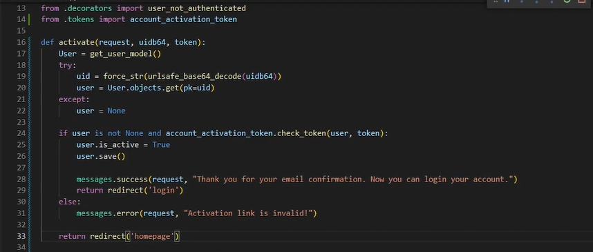

I'll provide an ER (Entity-Relationship) diagram based on the models you've described. Here's a visual representation of the relationships between your Django models:

```plaintext
+--------------+         +---------------+       +----------------+        +------------------+
|    Users     |         |   UserInfo    |       | RecruiterInfo  |        | StudentConsent   |
+--------------+         +---------------+       +----------------+        +------------------+
| uid (PK)     | 1     1 | user (FK) (PK)|       |                |        | recruiter (FK)   |
| password     |---------| firstName     |       |                |        | user (FK)        |
| email        |         | lastName      |       |                |        | consent          |
| dateJoined   |         | dob           |       |                |        | isHired          |
| isAdmin      |         | tenthMarks    |       |                |        |                  |
|              |         | twelvethMarks |       |                |        |                  |
|              |         | graduation    |       |                |        |                  |
|              |         | motherName    |       |                |        |                  |
|              |         | fatherName    |       |                |        |                  |
+--------------+         +---------------+       +----------------+        +------------------+
        |                        |                      |                            |
        | 1                    1 |                  1 |                            |
        |                        |                      |                            |
+----------------+        +---------------+       +----------------+         +-------------------+
| SelectedStudents|        |                |       |                |         |                 |
+----------------+        |                |       |                |         |                 |
| user (FK)      |        |                |       | recruiter (FK) |         |                 |
| recruiter (FK) |        |                |       |                |         |                 |
| roundQualifiedFor|       |                |       |                |         |                 |
+----------------+        +---------------+        +----------------+        +-----------------+
```

### Explanation of Relationships in the ER Diagram:

- `Users` and `UserInfo` have a one-to-one relationship via the `user` field in `UserInfo`.
- `Users` and `StudentConsent` have a one-to-many relationship via the `user` field in `StudentConsent`.
- `RecruiterInfo` and `StudentConsent` have a one-to-many relationship via the `recruiter` field in `StudentConsent`.
- `Users` and `SelectedStudents` have a one-to-many relationship via the `user` field in `SelectedStudents`.
- `RecruiterInfo` and `SelectedStudents` have a one-to-many relationship via the `recruiter` field in `SelectedStudents`.

This diagram visually represents the relationships between your models, illustrating how they are connected through foreign keys and one-to-one relationships. Adjustments can be made based on any further relationships or additional details you might need within your application.
